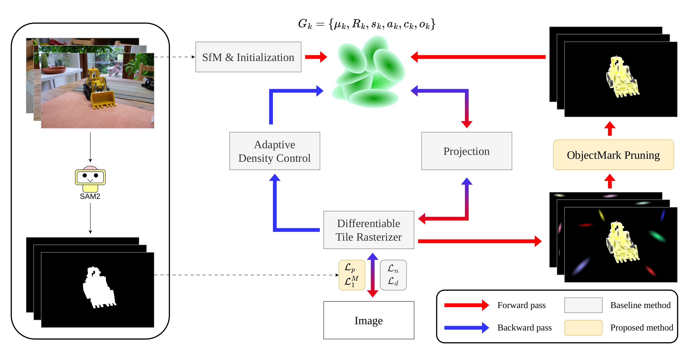

# Object-Aware Loss for Mask-Guided Mesh Reconstruction Based on 2D Gaussian Splatting

**Sunghyun Woo · Jeongil Seo · HeeKyung Lee**

<p align="center">
  
</p>

This repository implements mask-guided object-level mesh reconstruction on top
of [2D Gaussian Splatting](https://github.com/hbb1/2d-gaussian-splatting). It
adds foreground-masked appearance supervision, alpha polarization, learnable
per-Gaussian ObjectMark scores, and ObjectMark-based pruning while retaining
the 2DGS geometry regularizers and TSDF mesh extraction.

## Installation

Clone the repository with its CUDA submodules and create the training
environment:

```bash
git clone --recursive https://github.com/WooSungHyun03/FocusGS.git
cd FocusGS
conda env create --file environment.yml
conda activate object-aware-2dgs
```

For a clone created without `--recursive`, run
`git submodule update --init --recursive` before creating the environment. The
recursive checkout includes the differentiable rasterizer, Simple-KNN, and the
official SAM 2 implementation under `submodules/`. The single provided
environment installs the two CUDA extensions and all SAM 2 runtime dependencies
together using Python 3.10, PyTorch 2.5.1, CUDA 11.8, and Open3D 0.18. The mask
preprocessor loads the pinned SAM 2 source directly from its submodule, so no
second environment or SAM-specific installation step is needed. A compatible
system CUDA toolkit is required to compile the rasterizer and Simple-KNN
extensions.

## Dataset Preparation

First prepare posed RGB images using the COLMAP layout inherited from 2DGS.
Training additionally requires one binary target-object mask per image. The
paper uses the masks supplied with DTU and BlendedMVS; SAM 2 was used to prepare
the Mip-NeRF 360 object masks.

Download an official SAM 2.1 checkpoint from Meta's release host:

```bash
mkdir -p checkpoints
curl -L \
  https://dl.fbaipublicfiles.com/segment_anything_2/092824/sam2.1_hiera_large.pt \
  -o checkpoints/sam2.1_hiera_large.pt
```

Prompt the object on the first image in lexicographic order through the
interactive UI. The script propagates that prompt across the remaining images;
mask generation is therefore prompted, not fully automatic.
The preprocessing code is included in this repository as
`scripts/mask_generater.py`, adapted from the supplied SAM 2 wrapper so no
external local source path is required.

Run the UI preprocessing command:

```bash
python scripts/mask_generater.py \
  --dataset-dir <path_to_scene> \
  --checkpoint checkpoints/sam2.1_hiera_large.pt \
  --ui
```

In the UI, left-click foreground points, right-click background points, press
`u` to undo the latest point, and press Enter to confirm. For scenes whose RGB
directory is named `images_2`, add `--images images_2`. Existing masks are not
replaced unless `--overwrite` is supplied. The UI requires a desktop display or
X11 forwarding.

The script writes single-channel masks directly to `mask/`, preserving each
RGB filename. White denotes the target object and black denotes background.
PNG, JPEG, BMP, and TIFF images are supported. Before training, verify the
resulting layout:

```text
data/<scene>/
├── images/
│   ├── 000000.png
│   └── ...
├── mask/
│   ├── 000000.png
│   └── ...
└── sparse/
    └── 0/
        ├── cameras.bin
        ├── images.bin
        └── points3D.bin
```

Masks are loaded by exact filename or matching stem, binarized, and resized
with nearest-neighbor interpolation when required. Missing, ambiguous, or
unreadable masks stop training with an explicit error. The same
`object-aware-2dgs` environment is used for mask generation, training,
rendering, and evaluation.

## Training and Evaluation

Train a prepared scene with the paper method encoded as the default behavior:

```bash
python train.py -s <path_to_scene> -m <path_to_output>
```

Render views and extract the bounded TSDF mesh:

```bash
python render.py -s <path_to_scene> -m <path_to_output>
```

The inherited unbounded extractor is available for large scenes:

```bash
python render.py -s <path_to_scene> -m <path_to_output> \
  --unbounded --mesh_res 1024 --skip_train --skip_test
```

Rendered-view PSNR, SSIM, and LPIPS are computed with:

```bash
python render.py -s <path_to_scene> -m <path_to_output> --skip_train --skip_mesh
python metrics.py -m <path_to_output>
```

Dataset drivers are provided for the paper benchmarks:

```bash
# DTU; add --dtu-official <official_evaluation_root> for Chamfer evaluation
python scripts/dtu_eval.py --dtu <prepared_dtu_root> --skip-evaluation

# BlendedMVS; provide the prepared scene directory names
python scripts/blendedmvs_eval.py \
  --blendedmvs <prepared_blendedmvs_root> \
  --scenes <scene_1> <scene_2> <scene_3> <scene_4> \
           <scene_5> <scene_6> <scene_7> <scene_8>

# Mip-NeRF 360 scenes evaluated in the manuscript
python scripts/m360_eval.py --mipnerf360 <prepared_mipnerf360_root>
```

The repository includes the inherited DTU geometry evaluator. The manuscript's
mesh-rendering mIoU, mACC, and masked-ground-truth PSNR rely on an Nvdiffrast
evaluation pipeline that is not present here; no substitute command is claimed
for those segmentation and mesh-rendering metrics.

## Acknowledgements

This implementation is based on
[2D Gaussian Splatting](https://github.com/hbb1/2d-gaussian-splatting), which
builds on
[3D Gaussian Splatting](https://github.com/graphdeco-inria/gaussian-splatting).
It uses the modified differentiable surfel rasterizer, Simple-KNN, Open3D TSDF
fusion, MultiNeRF rendering utilities, LPIPS evaluation, and the DTU and Tanks
and Temples evaluation code inherited from 2DGS. The official
[SAM 2](https://github.com/facebookresearch/sam2) implementation is included as
a Git submodule for mask preprocessing. See
[THIRD_PARTY_NOTICES.md](THIRD_PARTY_NOTICES.md) for component provenance.

This work was supported by the Institute of Information & Communications
Technology Planning & Evaluation (IITP) grant funded by the Korea government
(MSIT) (No. 2023-0-00076, National Program of Excellence in Software, Dong-A
University).

## Citation

Publication metadata is not yet available. Please cite the current manuscript
and update the entry after publication:

```bibtex
@misc{woo2026objectaware,
  title  = {Object-Aware Loss for Mask-Guided Mesh Reconstruction Based on 2D Gaussian Splatting},
  author = {Woo, Sunghyun and Seo, Jeongil and Lee, HeeKyung},
  year   = {2026},
  note   = {Manuscript}
}
```

Please also cite 2DGS:

```bibtex
@inproceedings{huang2024twodgs,
  title     = {2D Gaussian Splatting for Geometrically Accurate Radiance Fields},
  author    = {Huang, Binbin and Yu, Zehao and Chen, Anpei and Geiger, Andreas and Gao, Shenghua},
  booktitle = {ACM SIGGRAPH 2024 Conference Papers},
  year      = {2024},
  doi       = {10.1145/3641519.3657428}
}
```

## License

This derivative is distributed under the inherited
[Gaussian-Splatting License](LICENSE.md), which permits non-commercial research
and evaluation use. Existing upstream copyright and attribution notices must
be retained; see [NOTICE.md](NOTICE.md).
